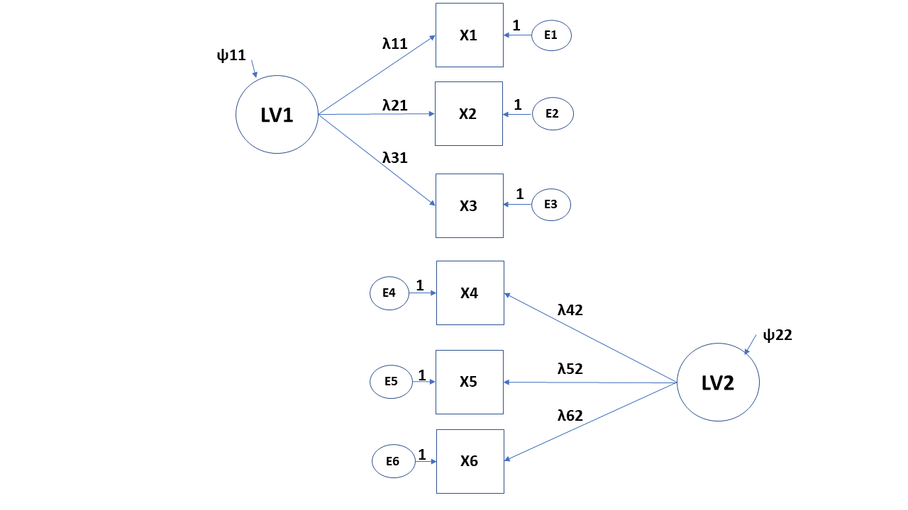

```{r setup, include=FALSE}
options(htmltools.dir.version = FALSE)
knitr::opts_chunk$set(
  fig.width=9, fig.height=3.5, fig.retina=3,
  out.width = "100%",
  cache = FALSE,
  echo = TRUE,
  message = FALSE, 
  warning = FALSE,
  hiline = TRUE
)
```

```{r xaringan-themer, include=FALSE, warning=FALSE}
library(xaringanthemer)
style_mono_accent(
  base_color = "#440099",
  header_font_google = google_font("Helvetica"),
  text_font_google   = google_font("Helvetica", "300", "300i"),
  code_font_google   = google_font("Fira Code"),
  code_font_size = '1.1rem',
  text_color = 'black',
  text_font_size = '24px',
  colors = c(red = "#f34213",
             green = "#136f63")
)
```


<style type="text/css">
body, td {
   font-size: 15px;
}
code.r{
  font-size: 15px;
}
pre {
  font-size: 20px
}
.huge .remark-code { /*Change made here*/
  font-size: 200% !important;
}
.tiny .remark-code { /*Change made here*/
  font-size: 80% !important;
}

---

</style>

## Press record


---

## Intended learning outcomes

Motivate utilisation of path and CFA models <br/> 
Argue how they connect to other models that we covered at the course. <br/><br/>

Calculate number of free parameters and degrees of freedom of the proposed model. <br/><br/>

Build a model in R statistical environment, estimate, and interpret the coefficients. <br/><br/>

Criticise, modify, compare, and evaluate the fit of the proposed models. 

---

## Structural equation modelling (SEM)

General framework that uses various models to test relationships among variables <br/>

Other terms: covariance structure analysis, covariance structure modelling, __causal modelling__<br/>

Sewell Wright - "mathematical tool for drawing __causal__ conclusions from a combination of of observational data and __theoretical assumptions__" 

Waves:
  1. Latent structures - factor analysis <br/>
  2. Causal modelling through path models <br/>
  3. Structural causal models <br/> <br/><br/>
  
SEM is a general modelling framework that is composed of measurement model and the structural model. 

???
Judea Pearl - [The Causal Foundations of Structural Equation Modeling](https://ftp.cs.ucla.edu/pub/stat_ser/r370.pdf)

Measurement model focuses on the estimation of latent or composite variables <br/>
Structural model focuses on the estimation of relations between manifest  and/or latent variables in the model (path model) <br/>

Terminology:  <br/>

Manifest variables: observed/collected variables <br/> <br/> 
Latent variables: infered measures - hypothetical constructs  <br/>
 - Indicator variables: measures used to infer the latent concepts
<br/>
<br/> 

Endogenous variables: dependent outcomes <br/> <br/> 
Exogenous variables: predictors <br/> <br/> <br/> 

Focus on covariance structure instead of mean <br/> <br/> 
---

class: inverse, middle, center
# Latent structures
---

## Latent space of measures

--
Principal Component Analysis (PCA) <br/><br/>
Exploratory Factor Analysis (EFA) <br/><br/>
Confirmatory Factor Analysis (CFA)

???
Differences between PCA and EFA:<br/><br/>
[Link 1](https://stats.stackexchange.com/a/95106)<br/><br/>
[Link 2](https://stats.stackexchange.com/a/288646)
---

## Exploratory factor analysis (EFA)

Multivariate statistical procedure (Spearman): understanding and accounting for variation and covariation among of set of observed variables by postulating __latent__ structures (factors)<br/><br/>

Factor: unobservable variable that influences more than one observed measure and accounts for their intercorrelation <br/><br/>

If we partial out latent construct then intercorrelations would be zero <br/><br/>

Factor analysis decomposes variance: __a) common variance (communality)__ and __b) unique variance__

???
Thourough example of EFA in R: https://psu-psychology.github.io/psy-597-SEM/06_factor_models/factor_models.html#overview
---

## EFA versus CFA

Reproduce observer relationships between measured variables with smaller number of latent factors <br/><br/>

EFA is data-driven approach: weak or no assumptions on a number of latent dimensions and factor loadings (relations between indicators and factors) <br/> <br/>

CFA is theory-driven approach: strong assumptions for both things <br/><br/>

EFA is used earlier in the process of questionnaire development and construct validation

---

## Factor model

```{r, echo=FALSE, out.width = '90%',fig.align='center'}

```

---

## Factor or measurement model

Is linear regression where the main predictor is latent or unobserved:   <br/>

$$y=\tau+\lambda*\eta+\epsilon$$<br/><br/>
$y_1=\tau_1+\lambda_1*\eta+\epsilon_1$<br/>
$y_2=\tau_2+\lambda_2*\eta+\epsilon_2$<br/>
$y_3=\tau_3+\lambda_3*\eta+\epsilon_3$<br/><br/>

$\tau$ - the item intercepts or means<br/>
$\lambda$ - factor loadings - regression coefficients  <br/>
$\epsilon$ - error variances and covariances  <br/>
$\eta$ - the latent predictor of the items<br/>
$\psi$ - factor variances and covariances  <br/>
---

## Exploratory factor model

```{r, echo=FALSE, out.width = '90%',fig.align='center'}
knitr::include_graphics("image2.png")
```

---

## Confirmatory factor model

```{r, echo=FALSE, out.width = '90%',fig.align='center'}

```

---

## Defining latent variables

LVs are not measured, however we can still infer them from the observed data. To be able to do so, we need to define their scale:

1. Marker variable: single factor loading constraint to 1 <br/><br/>
2. Standardized latent variables: setting variance of variable to 1  (Z-score) <br/><br/> 
3. Effects-coding: constraints that all of the loadings to one LV average 1.0 or that their sum is equal to number of indicators

???
https://www.researchgate.net/publication/255606342_A_Non-arbitrary_Method_of_Identifying_and_Scaling_Latent_Variables_in_SEM_and_MACS_Models
---
## Indicator variable and Standardizing LVs

```{r, echo=FALSE, out.width = '70%',fig.align='center'}

```

---

## Effect coding 

```{r, echo=FALSE, out.width = '40%',fig.align='center'}
knitr::include_graphics("Effect.png")
```

---
## First step: Specification of the model

```{r, echo=FALSE, echo=FALSE}
set.seed(456)
Babies=data.frame(Age=round(runif(100,1,30)), Weight=rnorm(100,4000,500))
Babies$Height=rnorm(100,40+0.2*Babies$Age+0.004*Babies$Weight, 5)
Babies$Gender=rbinom(100,1,0.5)
Babies$Crawl=rbinom(100,1,0.031*Babies$Age+0.00001*Babies$Weight-0.06*Babies$Gender)
Babies$TummySleep=rbinom(100,1,0.5)
Babies$PhysicalSt=rnorm(100,10+0.3*Babies$Height+0.1*Babies$Age-0.06*Babies$Gender+0.15*Babies$TummySleep,5)
Babies$Gender=as.factor(Babies$Gender)
levels(Babies$Gender)=c('Girls','Boys')
```

```{r, warning=FALSE, message=FALSE, echo=FALSE}
#install.packages('faux')
require(faux)
set.seed(456)

cmat <- c(1, .4,.4, .1, .1, .1,
          .4, 1,.3, .1, .1, .1,
          .4,.2, 1, .1, .1, .1,
          .1,.1,.1,  1, .4, .4,
          .1,.1,.1, .4,  1, .2,
          .1,.1,.1, .4, .2,  1)

vars<-rnorm_multi(n=100, 6,30,5,cmat)

names(vars)=c('TimeOnTummy','PreciseLegMoves','PreciseHandMoves','Babbling','Screeching','VocalImitation')

Babies=cbind(Babies,vars)
```

Total number of parameters that we can estimate: $\frac{variables*(variables+1)}{2}$ <br/> <br/> <br/>

```{r}
Matrix<-cov(vars)
Matrix[upper.tri(Matrix)]<-NA
kableExtra::kable(Matrix, format = 'html', digits = 3, align='l') %>% kableExtra::kable_styling(font_size = 14)
```

---
## Theory and previous results

Previous work in this area found that two __congeneric__ latent factors explain covariances of our six indicators: motoric and verbal latent component <br/><br/>

```{r, echo=FALSE, out.width = '65%',fig.align='center'}

```

---
## Estimated number of parameters

```{r, echo=FALSE, out.width = '50%',fig.align='center'}
knitr::include_graphics("parameters.png")
```
--
Loadings $(\lambda)$: 4 parameters<br/><br/>
Residual variances $(\epsilon)$ : 6 parameters<br/><br/>
Factor variances and covariances $(\psi)$ : 3 parameters<br/><br/>
With intercepts: + 6 
---
## Second step: model identification

1. Under-indentified: more free parameters than total possible parameters  <br/> <br/>
2. Just-identified: equal number of free parameters and total possible parameters  <br/><br/>
3. Over-identified: fewer free parameters than total possible parameters  <br/> <br/>
<br/>
Parameters can either be: free, fixed or constrained  <br/>
---
## Third step: estimation of the model

```{r, message=FALSE, warning=FALSE}
#install.packages('lavaan')
require(lavaan)
model1<-'
motor =~ TimeOnTummy + PreciseLegMoves + PreciseHandMoves
verbal =~ Babbling + Screeching + VocalImitation
'

fit1<-cfa(model1, data=Babies)
```

```{css, echo=FALSE}
pre {
  max-height: 300px;
  overflow-y: auto;
}

pre[class] {
  max-height: 100px;
}
```

```{css, echo=FALSE}
.scroll-100 {
  max-height: 100px;
  overflow-y: auto;
  background-color: inherit;
}
```
---

## Results of the model

```{r}
summary(fit1)
```

---

## Results: visual


```{r, echo=FALSE, out.width = '90%',fig.align='center'}

```

---

## Interpretation of the coefficients: factor loadings

- When unstandardized and loaded on a single factor, then unstandardized regression coefficients. Model predicted difference in the LVs between groups that differ in 1-unit on the predictor <br/>  <br/>

- When loaded on multiple factors, then regression coefficients become contingent on other factors (check Lecture 1, slide 11)  <br/>  <br/>

- When standardized and loaded on a single factor (congeneric structure), then standardized loadings are estimated correlations between indicators and LVs <br/>  <br/>

- When standardized and loaded on a multiple factors, then same as the second option only standardized (beta weights)  <br/>

---
class: inverse, middle, center
# Causal model
---

## Structural part of the model (path analysis)

Model that test relationship between set of variables, often arranged in some sort of structural form.
<br/>

A common focus of the path model is the estimation of mediation between X and Y.

???
.center[
 <br/>
]
---
## First step: Specification of the model

.center[
 <br/>
]
???
Representation of our hypothetical assumptions in the form of the structural equation model
---

## Can model be estimated? 

Total Number of the parameters that we can estimate: $\frac{variables*(variables+1)}{2}$ <br/> <br/> <br/>

.center[
 <br/>
]

---

## Number of observations

```{r,echo=F, warning=FALSE, message=FALSE}
library(truncnorm)
require(lavaan)
set.seed(456)
Babies=data.frame(Age=round(runif(100,1,30)), Weight=rnorm(100,4000,500))
Babies$Height=rnorm(100,40+0.2*Babies$Age+0.004*Babies$Weight, 5)
Babies$Sex=rbinom(100,1,0.5)
Babies$Nutrition=rtruncnorm(n=100, a=0, b=30, mean=5, sd=10)
Babies$PhyExer=rnorm(100, 180,50)
Babies$GMA=rnorm(100, 180,50)
Babies$SocialBeh=rnorm(100, 180+Babies$PhyExer,80)
Babies$TummySleep=rbinom(100,1,0.5)
Babies$CognitiveAb=rnorm(100,10+7*Babies$Nutrition+0.1*Babies$PhyExer+3*Babies$GMA+0.03*Babies$PhyExer*Babies$SocialBeh,5)
Babies$Sex=as.factor(Babies$Sex)
levels(Babies$Sex)=c('Girls','Boys')
```

```{r}
Matrix<-cov(Babies[,c('Nutrition','PhyExer','GMA','SocialBeh','CognitiveAb')])
Matrix[upper.tri(Matrix)]<-NA
knitr::kable(Matrix, format = 'html')
```

---
## How many parameters are we estimating (path model)?

How many degrees of freedom do we have without the model? 

--
.center[
 <br/>
]

Number of observations (total number of parameters) = 15<br/>
Empty model = variances and covariances <br/>
Degrees of freedom (df) __= 15 - 8 = 7__ <br/>

???
Most of the time (CFA model or other software):
Degree of freedom for null model = $(\frac{variables*(variables+1)}{2}) - variables$

```{r}
Matrix<-cov(Babies[,c('Nutrition','PhyExer','GMA','SocialBeh','CognitiveAb')])
Matrix[upper.tri(Matrix)]<-NA
Matrix[lower.tri(Matrix)]<-NA
knitr::kable(Matrix, format = 'html')
```
---
## How many parameters (our model)?

.center[
 <br/>
]

Free parameters = variances + covariances + regression pathways = 14
---

## Second step: model identification

1. Under-indentified: more free parameters than total possible parameters  <br/> <br/>
2. Just-identified: equal number of free parameters and total possible parameters  <br/><br/>
3. Over-identified: fewer free parameters than total possible parameters  <br/> <br/>
<br/>
Parameters can either be: free, fixed or constrained  <br/>

---

## Third step: estimation of the model

```{css, echo=FALSE}
pre {
  max-height: 300px;
  overflow-y: auto;
}

pre[class] {
  max-height: 100px;
}
```

```{css, echo=FALSE}
.scroll-100 {
  max-height: 100px;
  overflow-y: auto;
  background-color: inherit;
}
```

```{r , warning=FALSE, message=FALSE}
modelAbility<-'
SocialBeh~Nutrition+PhyExer+GMA
CognitiveAb~SocialBeh+Nutrition+GMA
'
```
--
```{r, warning=FALSE, message=FALSE}
fit1<-sem(modelAbility, data=Babies)
summary(fit1)
```
---
## Direct and indirect

.center[
 
]

Direct effect (c): subgroups/cases that differ by one unit on X, but are equal on M are estimated to differ by __c__ units on Y. <br/>

Indirect effect: <br/>
  a) X -> M: cases that differ by one unit in X are estimated to differ by __a__ units on M <br/>
  b) M -> Y: cases that differ by one unit in M, but are equal on X, are estimated to differ by __b__ units on Y <br/><br/>
The indirect effect of X on Y through M is a product of __a__ and __b__. The two cases that differ by one unit on X are estimated to differ by __ab__ units on Y as a result of the effect of X on M which affects Y. 

---
## Direct and indirect

```{r, warning=FALSE, message=FALSE}
modelAbilityPath<-'
SocialBeh~Nutrition+a*PhyExer+GMA
CognitiveAb~b*SocialBeh+c*Nutrition+GMA

indirect := a*b
direct := c
total := indirect + direct
'
fitPath<-sem(modelAbilityPath, data=Babies)
summary(fitPath)
```
???
Interaction between the predictors can be included similar to the linear regression model by using (:) sign.<br/> <br/>

modelAbilityInteraction<-<br/>
SocialBeh~Nutrition+PhyExer+GMA+__PhyExer:GMA__<br/>
CognitiveAb~SocialBeh+Nutrition+GMA<br/>

---

## Step four: model evaluation

Chi-square test: measure of how well model-implied covariance matrix fits data covariance <br/> <br/>

We would prefer not to reject the null hypothesis in this case <br/>

Assumptions: <br/>
Multivariate normality <br/>
N is sufficiently large (150+)<br/>
Parameters are not at boundary or invalid (e.g. variance of zero)<br/><br/><br/>

With the large samples it is sensitive to small misfits <br/>
Nonormality induces bias <br/> 
---

## Other fit indices
```{r}
summary(fit1, fit.measures=TRUE)

```

---

## Other fit indices
.center[

]

???
TLI: fit of .95 indicates that the fitted model improves the fit by 95% relative to the null mode, works OK with smaller sample sizes <br/> <br/>
CFI: Same as TLI, but not very sensitive to sample size <br/> <br/>
RMSEA: difference between the residuals of the sample covariance matrix and hypothesized model. If we have different scales it is hard to interpret, then we can check standardised root mean square residual (SRMR)<br/><br/>
---
class: inverse, middle, center
# Structural Equation Model
---
## SEM, finally

```{r, echo=FALSE, out.width = '80%',fig.align='center'}
knitr::include_graphics("SEM.png")
```
---

## Estimation of SEM

```{r, echo=FALSE, echo=FALSE}
set.seed(456)
Babies=data.frame(Age=round(runif(100,1,30)), Weight=rnorm(100,4000,500))
Babies$Height=rnorm(100,40+0.2*Babies$Age+0.004*Babies$Weight, 5)
Babies$Gender=rbinom(100,1,0.5)
Babies$Crawl=rbinom(100,1,0.031*Babies$Age+0.00001*Babies$Weight-0.06*Babies$Gender)
Babies$TummySleep=rbinom(100,1,0.5)
Babies$PhysicalSt=rnorm(100,10+0.3*Babies$Height+0.1*Babies$Age-0.06*Babies$Gender+0.15*Babies$TummySleep,5)
Babies$Gender=as.factor(Babies$Gender)
levels(Babies$Gender)=c('Girls','Boys')
```

```{r, warning=FALSE, message=FALSE, echo=FALSE}
#install.packages('faux')
require(faux)
set.seed(456)

cmat <- c(1, .4,.4, .1, .1, .1,
          .4, 1,.3, .1, .1, .1,
          .4,.2, 1, .1, .1, .1,
          .1,.1,.1,  1, .4, .4,
          .1,.1,.1, .4,  1, .2,
          .1,.1,.1, .4, .2,  1)

vars<-rnorm_multi(n=100, 6,30,5,cmat)

names(vars)=c('TimeOnTummy','PreciseLegMoves','PreciseHandMoves','Babbling','Screeching','VocalImitation')

Babies=cbind(Babies,vars)
```

```{r}
model4<-'
#CFA model
motor =~ TimeOnTummy + PreciseLegMoves + PreciseHandMoves
verbal =~ Babbling + Screeching + VocalImitation

#Path model
motor ~ Age + Weight
verbal ~ Age + Weight
'

fit4<-sem(model4, data=Babies)
```

---
## Structural equation model: Results

```{r}
summary(fit4, standardized=TRUE)
```

---

## Prerequisites

Theory: Strong theoretical assumptions that could be used to draw causal assumptions that could be tested using the data and specification of the model <br/><br/>

Data: large samples <br/>
 - We are not that interested in significance: <br/><br/>
  a) Overall behaviour of the model more interesting<br/><br/>
  b) More data higher probability of significant results (weak effects)<br/><br/>
  c) Latent models are estimated by anchoring on indicator variables, different estimation can result in different patterns<br/><br/>

---
## Problems with SEM and alternatives

1. Variables derived from the normal distribution <br/>
2. Observations independent <br/>
3. Large sample size <br/>

---
## Important aspects: theory 

- Understanding differences between Exploratory FA and Confirmatory FA <br/>
- How is linear model defined in the CFA<br/>
- Scaling of the latent variables <br/>
- Interpretation of the coefficients <br/>
- Number of free parameters versus total number of parameters <br/>
- Overall fit of the model 

---

## Important aspects: practice

- Specifying and estimating CFA model and path model <br/>
- Scaling the LVs by using marker variable <br/>
- Calculation of the direct and indirect pathways for predictors of interest <br/>
- Making a full SEM model <br/>

---

## Literature

Confirmatory Factor Analysis for Applied Research by Timothy A. Brown  <br/> <br/>

Chapters 9 of Principles and Practice of Structural Equation Modeling by Rex B. Kline <br/><br/> 


Latent Variable Modeling Using R: A Step-by-Step Guide by A. Alexander Beaujean <br/><br/>

---

## Thank you for your attention